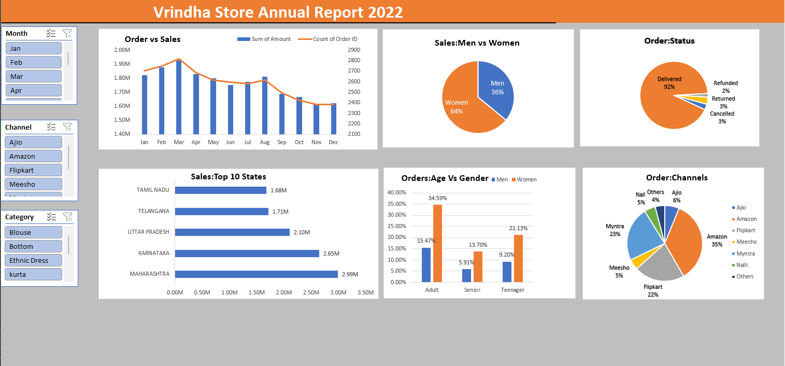

📊 Vrindha Store Sales Dashboard (Excel)

🛠️ Tools Used

- Microsoft Excel (Pivot Tables, Charts, Slicers)

---

📌 Project Overview

This project analyzes Vrindha Store's annual sales data (2022) using Excel to uncover key business insights such as sales trends, customer demographics, and order patterns.

---

📷 Dashboard Preview

---

📈 Key Insights

- Women contribute the majority of sales (~64%)
- Amazon is the top-performing sales channel
- Maharashtra generates the highest revenue among all states
- Adults are the most active customer segment
- Most orders are successfully delivered (~92%)

---

📊 Features

- Interactive slicers for:
  - Month
  - Sales Channel
  - Category
- Sales vs Orders trend analysis
- Top 10 states by sales
- Gender-based sales distribution
- Order status breakdown
- Age vs Gender insights

---

📁 Files Included

- "vrindha_dashboard.xlsx"
- "vrindha_dashboard.png"

---

🚀 Conclusion

This dashboard helps businesses quickly understand customer behavior, sales performance, and operational efficiency, enabling better decision-making.
